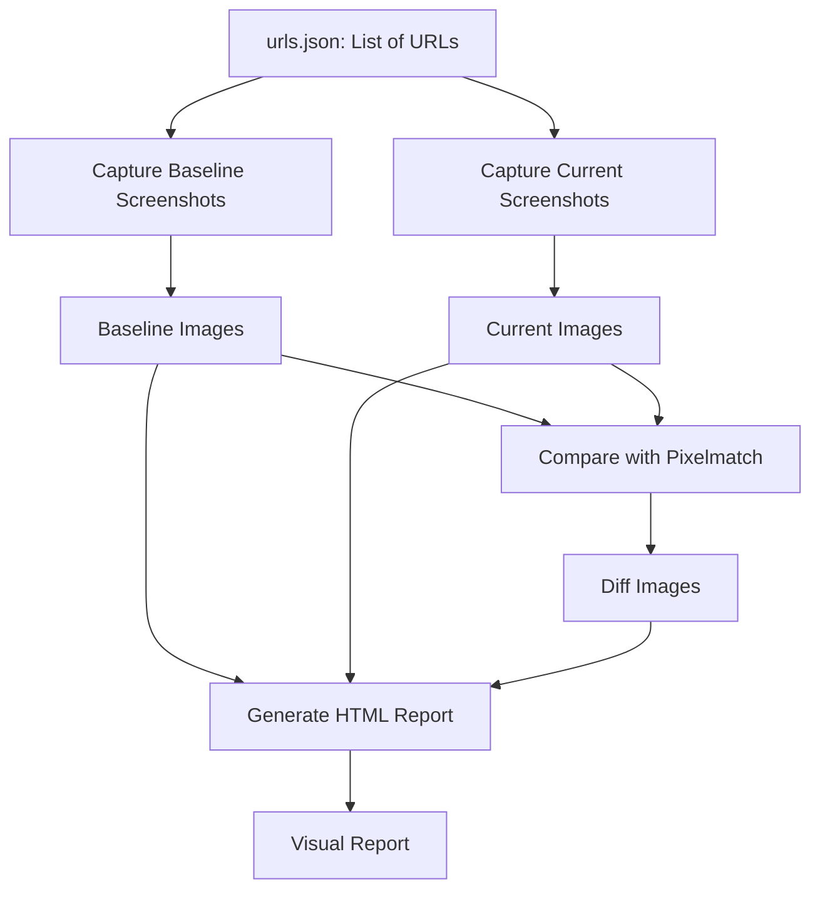

# Visual Bug Tracker

**Visual Bug Tracker** is an automated tool to detect visual regressions in web applications. It captures screenshots of web pages, compares them pixel-by-pixel, and generates a detailed HTML report highlighting any visual differences. This helps teams catch unintended UI changes before they reach production.

## Workflow Diagram



# Visual Bug Tracker

A powerful tool for detecting visual regressions in web applications by comparing screenshots before and after changes. Built with Playwright and Pixelmatch.

## Features

- Automated screenshot capture of web pages
- Pixel-perfect comparison of screenshots
- HTML report generation with side-by-side comparisons
- CLI interface for easy usage
- GitHub Actions integration for CI/CD
- Support for batch processing multiple URLs

## Installation

1. Clone the repository:
```bash
git clone https://github.com/yourusername/visual-bug-tracker.git
cd visual-bug-tracker
```

2. Install dependencies:
```bash
npm install
```

3. Install Playwright browsers:
```bash
npx playwright install chromium
```

## Usage

### Capture Screenshots

To capture baseline screenshots:
```bash
npx ts-node src/capture.ts --mode baseline --batch
```

To capture current screenshots:
```bash
npx ts-node src/capture.ts --mode current --batch
```

To capture a single URL:
```bash
npx ts-node src/capture.ts --mode current --url https://example.com
```

### Compare Screenshots

```bash
npx ts-node src/compare.ts
```

### Generate Report

```bash
npx ts-node src/generate-report.ts
```

## Configuration

Add your URLs to test in `urls.json`:
```json
{
  "urls": [
    "https://example.com",
    "https://your-site.com"
  ]
}
```


## Contributing

1. Fork the repository
2. Create your feature branch (`git checkout -b feature/amazing-feature`)
3. Commit your changes (`git commit -m 'Add some amazing feature'`)
4. Push to the branch (`git push origin feature/amazing-feature`)
5. Open a Pull Request
